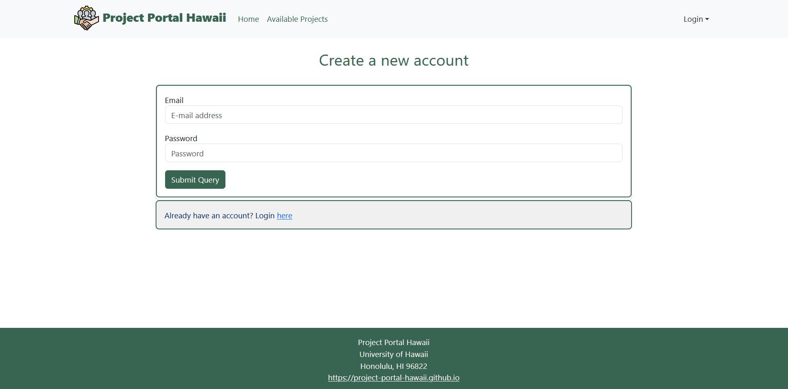
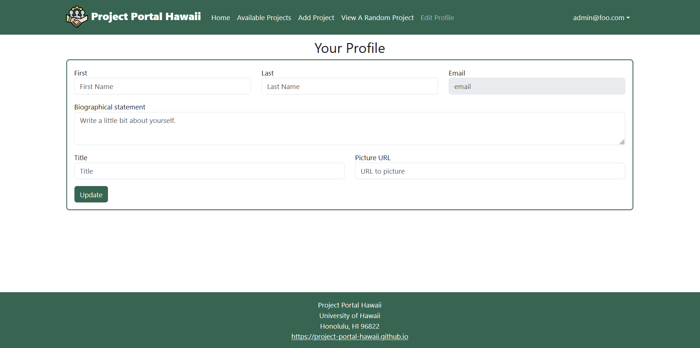
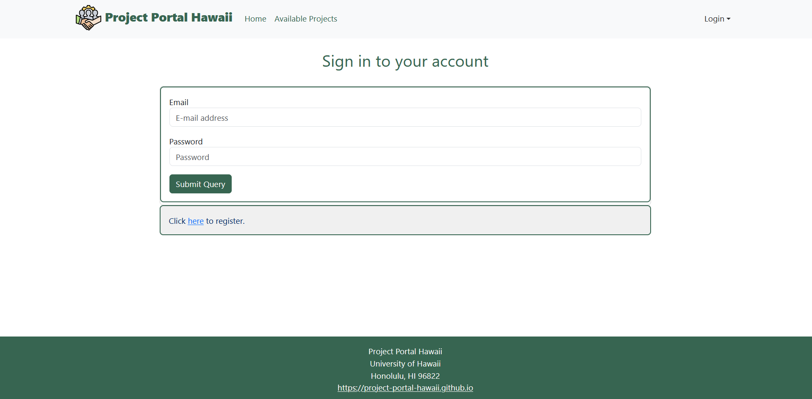
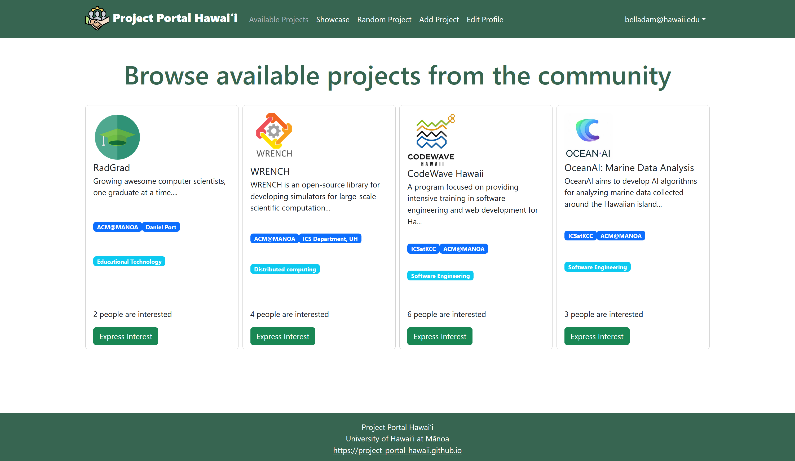
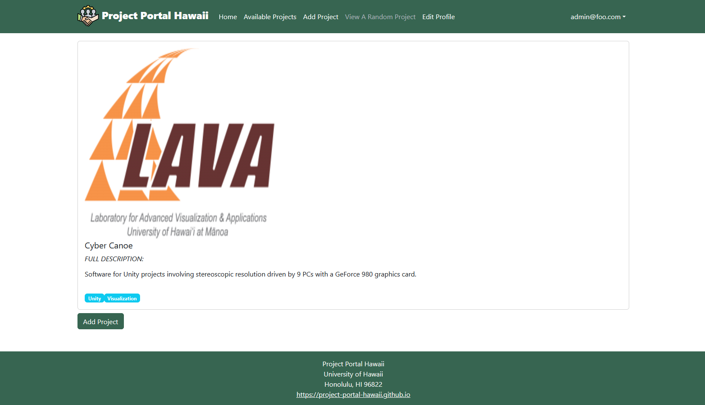
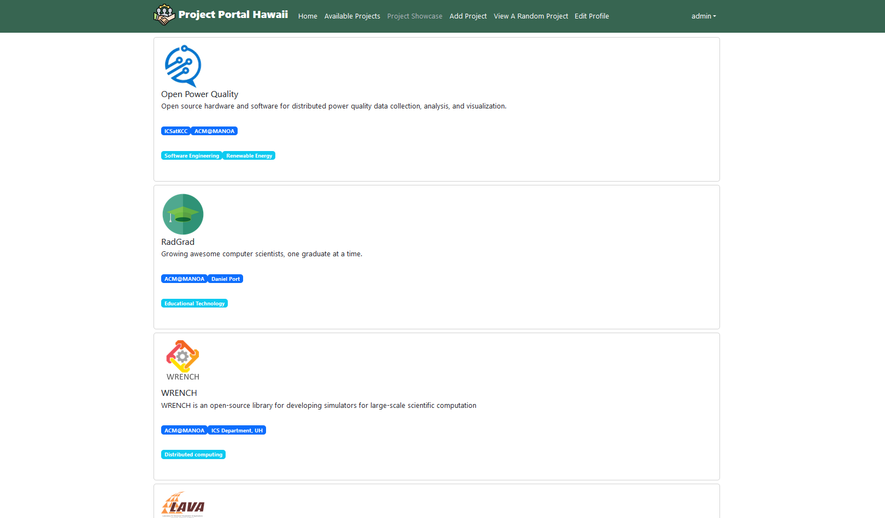
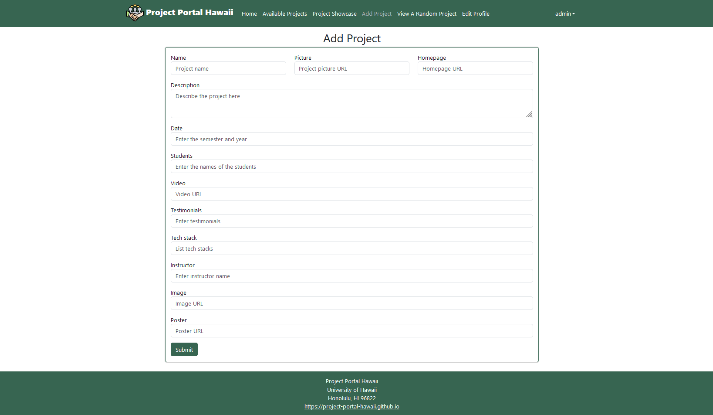
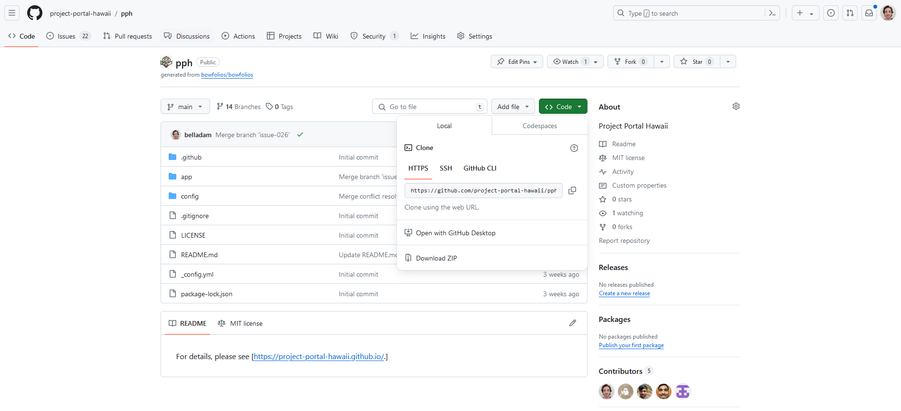
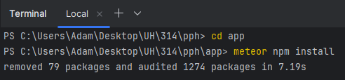
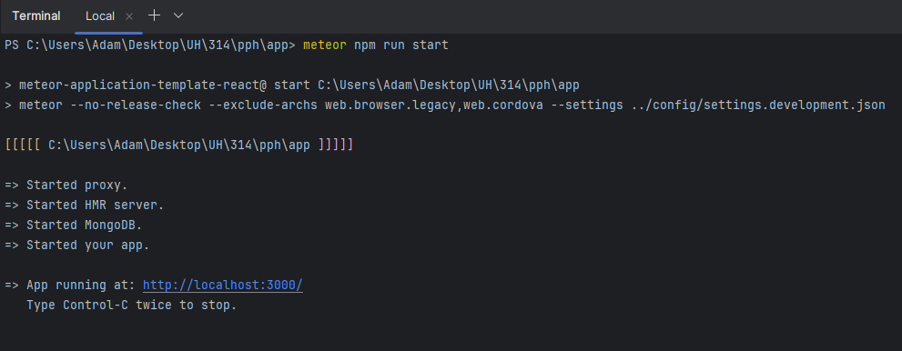

# Project Portal Hawaii
## Team
Adam Bell, Adriel White, Dmitry Gordeev, Gabriel White, and Tim Lum.

[Project Portal Hawaii GitHub Organization](https://github.com/project-portal-hawaii)   
[Team Contract](team-contract.md)   

## Overview
* The problem: For students at UH Manoa, it can be difficult to find interesting projects that will improve the quality of their professional portfolios, or generally improve their skills related to their field of study. 
* The solution: A web application that enables professors or fellow students to post project ideas, and allows students to find the ideal project for gaining experience or earning credit for their classes.   

## Deployment
The application will be deployed on a web server, and will be accessible to anyone with an internet connection and available at address: [Project Portal Hawaii](http://64.23.208.76/)   

## Current Functionality
Our App is based on [Bowfolio](https://bowfolios.github.io) template, currently has 8 functioning pages: Landing, Sign-up, Sign-in, Avaiable Projects, View a Single Project, View Showcase Projects, Add Project, and Edit Profile. The landing page currently showcases all of the functioning pages but this will change.   

## User Guide
When entering the application for the first time, select the sign up option from the drop down menu in the top right. Doing so will bring you to this page where you can enter your email and password to register an account.   

### Sign-up Page
    

After signing up for an account, you will prompted to create a profile. This can be edited at a later time by visiting the Edit Profile page.   

### Edit Profile Page
   

If you already have an account, use the same drop down menu and select the sign in option. This will prompt you to enter your email address and password associated with your account.   

### Sign-in Page
   

After signing in, you are able to view different pages that highlight different projects. The Available Projects page lists all projects that are open to students.   

### Available Projects Page
   

If there are too many options to pick from, you can also view a randomized single project using the View a Random Project page.   

### View a Single Project Page
   

If you would like to see projects that have been completed in the past, you can do so using the Showcase Projects page.   

### View Showcase Projects Page
   

Finally, if you are interested in proposing a project for other students, click on the Add Project page where you can input information for a potential project.   

### Add Project Page
   

## Developer Guide
If you are interested in downloading, installing, running, and/or modifying this application, here is the guide to set up your development environment.   

### Clone the Repository
First, clone the repository locally to your computer via our [GitHub Project Portal Hawaii Repository](https://github.com/project-portal-hawaii/pph). Click on the green "<> Code" dropdown menu and clone the repositoy using any prefered method.   

   

## Install Node, Metor, and MongoSH.
Running, editing, and modifying the application requires downloading:
* [Node for JavaScript](https://nodejs.org/en/download)
* [Meteor](https://docs.meteor.com/install.html)
* [MongoSH](https://www.mongodb.com/docs/mongodb-shell/install/)   

## Install packages
Once you have the repository cloned and the required downloades, install packages by navigating to your app directory within pph, and run the following command:   

```meteor npm install```   

   

## Start Application
After installing the required packages, while in your app/ directory, run the following command to view the application in real time on your local environment:   

```meteor npm run start```   

   

## Begin Modifying
At this point, you can make changes within your IDE of choice and the changes will be displayed immediately by opening the following url in your web browser:    

[http://localhost:3000/](http://localhost:3000/)   

## Project Progress
* [Milestone 1](https://github.com/orgs/project-portal-hawaii/projects/1)
* [Milestone 2](https://github.com/orgs/project-portal-hawaii/projects/2)
* [Milestone 3](https://github.com/orgs/project-portal-hawaii/projects/6)   
