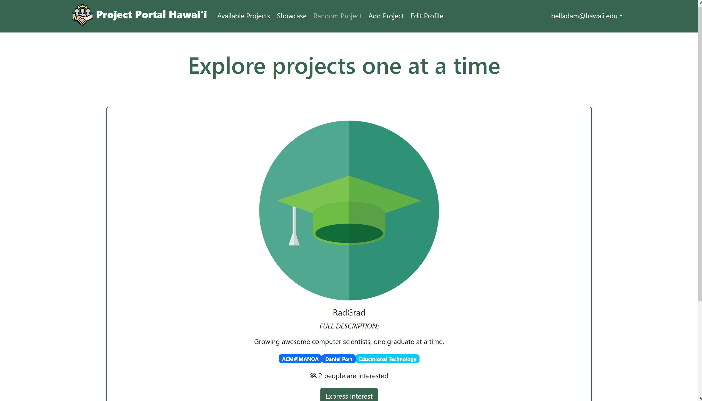
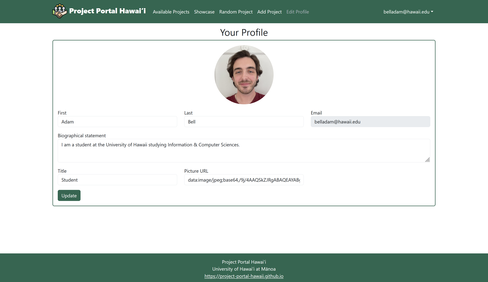

# Project Portal Hawaii
## Team
Adam Bell, Adriel White, Dmitry Gordeev, Gabriel White, and Tim Lum.

[Team Contract](team-contract.md)

## Overview
* The problem: For students at UH Manoa, it can be difficult to find interesting projects that will improve the quality of their professional portfolios, or generally improve their skills related to their field of study. 
* The solution: A web application that enables professors or fellow students to post project ideas, and allows students to find the ideal project for gaining experience or earning credit for their classes.

## Mockup Ideas
The application would ask the user whether they were in search of a project to complete, or if they would like to submit a project of their own. Students searching for a project would be able to fill out a form specifying different categories of projects; e.g. difficulty, field of study, estimated time of completion, etc. Anyone submitting a project will also fill out a form with these fields. There will be a search feature with filter options, a rating system taking into account difficulty, and a forum for people to leave comments and ask questions about a project.

## Use Cases
Professors and faculty of UH Manoa would be able to use this application to post assignments in their courses and offer extra credit opportunities to their students. Students at the Univeristy of Hawaii would be able to use it in the reverse mannor, if an assignment has multiple options students would be able to find them here as well as browse any extra credit opportunities for their class.

## Beyond the Basics
If we were successful enough in building this web application, it could be utilized by the ICS department at UH Manoa, and even potentially expanded to other classes and majors within the school. This requires a polished and well built application. There is a lot of potential for improved functionality such as:
* A class structure where professors can send project ideas directly to a group of students.
* The ability to find and join a team of individual students who want to work on projects as a group.
* The potential for professionals outside of the University to post freelance small-scale projects.
* An accounts system that can auto-filter class-specific projects.

## Deployment
The application will be deployed on a web server, and will be accessible to anyone with an internet connection and available at address: [Project Portal Hawaii](http://64.23.208.76/)

## Current Functionality
Our App is based on [Bowfolio](https://bowfolios.github.io) template, currently has 7 functioning pages: Landing, Sign-up, Sign-in, Avaiable Projects, View a Single Project, Add Project, and Edit Profile. The landing page currently showcases all of the functioning pages but this will change. So far we have:

### Sign-up Page

 

### Sign-in Page

 

### Available Projects Page

 

### View a Single Project Page

 

### Add Project Page

 

### Edit Profile Page

 

## Project Progress
* [Milestone 1](https://github.com/orgs/project-portal-hawaii/projects/1)
* [Milestone 2](https://github.com/orgs/project-portal-hawaii/projects/2)
* [Milestone 3](https://github.com/orgs/project-portal-hawaii/projects/6)
